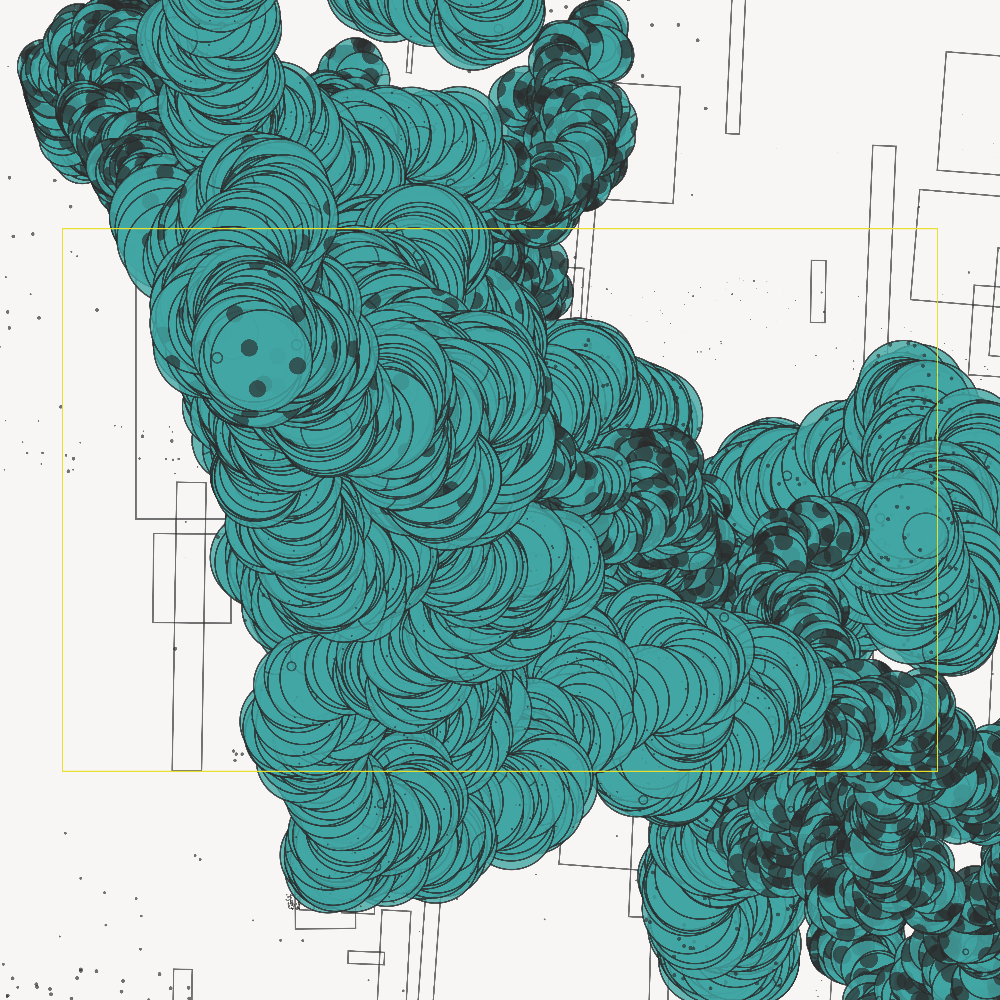
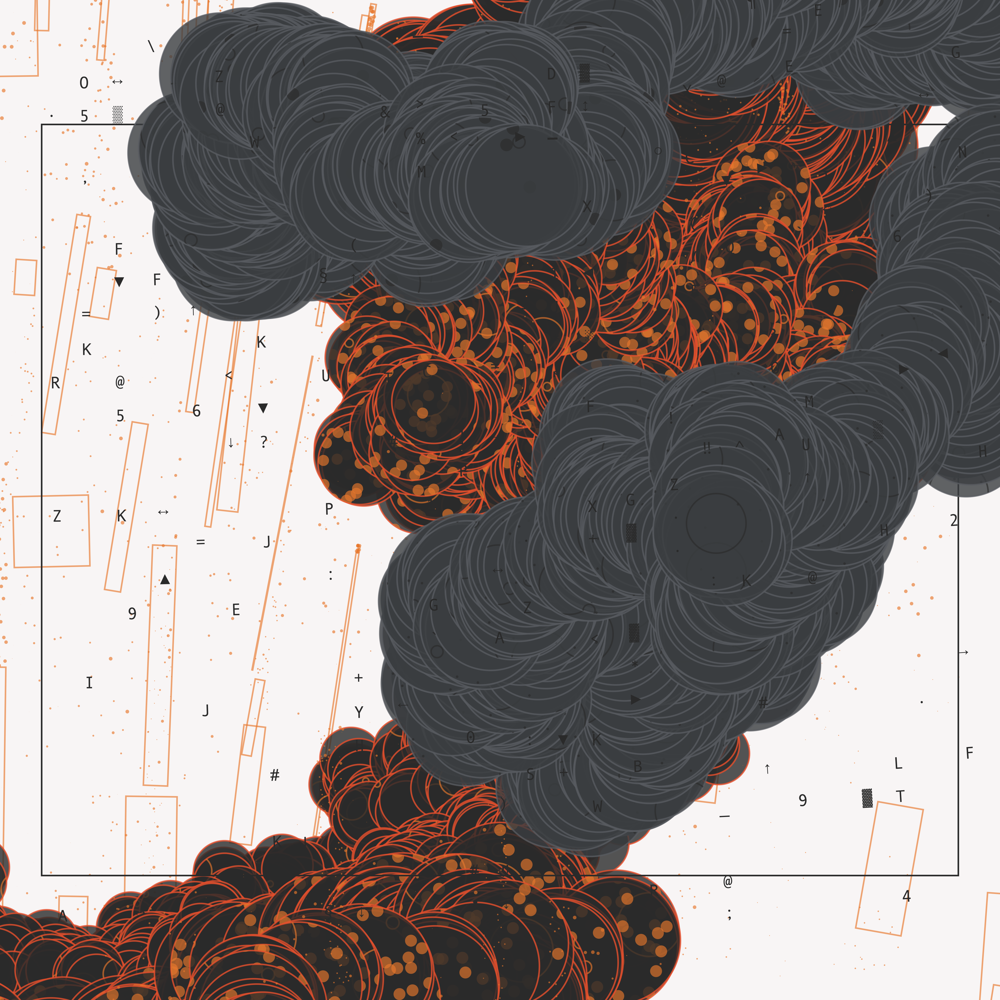

# Random Walk
Random walk algorithm exploration.

Made with [`canvas-sketch`](https://github.com/mattdesl/canvas-sketch), [`canvas-sketch-util`](https://github.com/mattdesl/canvas-sketch-util), and JavaScript. Works in your browser.

<div style="display: flex; gap: 20px;">


</div>


## How to run

```sh
npm install canvas-sketch-cli --global
npm install canvas-sketch-util --save
canvas-sketch random-worm.js --open
```

## How to use

- `Cmd+R` Refresh the browser window to generate a new output.
- `Cmd+S` Save the output as a .PNG image.

---

Originally created circa 2023.
